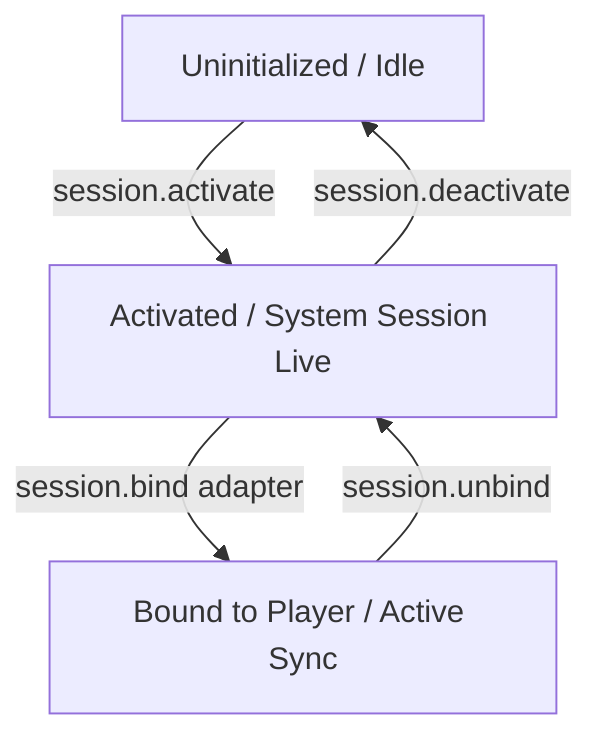

# Usage Guide

Learn how to integrate and use the `flutter_media_session` plugin in your application to synchronize media metadata and playback state with system-level controls using the modern **Adapter Pattern**.

---

## 1. The Modern Adapter Workflow (Recommended)

Instead of manually listening to stream events and writing complex sync logic, `flutter_media_session` uses an elegant **Adapter Pattern**. 

By keeping adapters in your application code, you avoid forcing heavy third-party audio dependencies (like `just_audio` or `media_kit`) on users who might not need them. 

Below are complete, production-ready, copy-pasteable adapter implementations for popular Flutter players.

### A. Copy-Ready `just_audio` Adapter

Create a file named `just_audio_media_session_adapter.dart` in your project and copy the code below:

```dart
import 'dart:async';
import 'package:flutter/foundation.dart';
import 'package:just_audio/just_audio.dart';
import 'package:flutter_media_session/flutter_media_session.dart';

/// A production-ready adapter to bridge [AudioPlayer] and [FlutterMediaSession].
class JustAudioMediaSessionAdapter implements MediaSessionAdapter {
  final AudioPlayer player;
  final MediaMetadata Function(AudioPlayer player)? metadataMapper;
  final bool manageLifecycle;

  final List<StreamSubscription> _subscriptions = [];
  FlutterMediaSession? _session;
  bool _isUpdating = false;

  JustAudioMediaSessionAdapter(
    this.player, {
    this.metadataMapper,
    this.manageLifecycle = false,
  });

  @override
  void bind(FlutterMediaSession session) {
    unbind();
    _session = session;

    if (manageLifecycle) {
      _session?.activate().catchError((e) {
        debugPrint('JustAudioAdapter: Failed to activate media session: $e');
      });
    }

    _subscriptions.add(player.playerStateStream.listen((_) => _syncPlaybackState()));
    _subscriptions.add(player.positionStream.listen((_) => _syncPlaybackState()));
    _subscriptions.add(player.durationStream.listen((_) {
      _syncMetadata();
      _syncPlaybackState();
    }));
    _subscriptions.add(player.speedStream.listen((_) => _syncPlaybackState()));
    _subscriptions.add(player.bufferedPositionStream.listen((_) => _syncPlaybackState()));
    _subscriptions.add(player.sequenceStateStream.listen((_) => _syncMetadata()));
    _subscriptions.add(session.onMediaAction.listen(_handleMediaAction));

    _syncMetadata();
    _syncPlaybackState();
  }

  @override
  void unbind() {
    for (final sub in _subscriptions) {
      sub.cancel();
    }
    _subscriptions.clear();

    if (manageLifecycle) {
      _session?.deactivate().catchError((e) {
        debugPrint('JustAudioAdapter: Failed to deactivate media session: $e');
      });
    }
    _session = null;
  }

  void _syncMetadata() {
    if (_session == null || _isUpdating) return;

    MediaMetadata metadata;
    if (metadataMapper != null) {
      metadata = metadataMapper!(player);
    } else {
      final currentItem = player.sequenceState?.currentSource;
      final tag = currentItem?.tag;

      String? title;
      String? artist;
      String? album;
      String? artworkUri;

      if (tag != null) {
        try {
          title = (tag as dynamic).title?.toString();
          artist = (tag as dynamic).artist?.toString();
          album = (tag as dynamic).album?.toString();
          artworkUri = (tag as dynamic).artworkUri?.toString();
        } catch (_) {
          title = tag.toString();
        }
      }

      metadata = MediaMetadata(
        title: title ?? 'Unknown Title',
        artist: artist ?? 'Unknown Artist',
        album: album,
        artworkUri: artworkUri,
        duration: player.duration ?? Duration.zero,
      );
    }

    _isUpdating = true;
    _session!.updateMetadata(metadata).catchError((e) {
      debugPrint('JustAudioAdapter: Failed to update metadata: $e');
    }).whenComplete(() => _isUpdating = false);
  }

  void _syncPlaybackState() {
    if (_session == null) return;

    final state = player.playerState;
    PlaybackStatus status = PlaybackStatus.idle;

    if (state.processingState == ProcessingState.buffering ||
        state.processingState == ProcessingState.loading) {
      status = PlaybackStatus.buffering;
    } else if (state.playing) {
      status = PlaybackStatus.playing;
    } else if (state.processingState == ProcessingState.completed) {
      status = PlaybackStatus.ended;
    } else if (state.processingState == ProcessingState.idle) {
      status = PlaybackStatus.idle;
    } else {
      status = PlaybackStatus.paused;
    }

    final playbackState = PlaybackState(
      status: status,
      position: player.position,
      speed: player.speed,
      bufferedPosition: player.bufferedPosition,
    );

    _session!.updatePlaybackState(playbackState).catchError((e) {
      debugPrint('JustAudioAdapter: Failed to update playback state: $e');
    });
  }

  void _handleMediaAction(MediaAction action) async {
    try {
      switch (action.name) {
        case 'play':
          await player.play();
          break;
        case 'pause':
          await player.pause();
          break;
        case 'stop':
          await player.stop();
          break;
        case 'seekTo':
          if (action.seekPosition != null) {
            await player.seek(action.seekPosition!);
          }
          break;
        case 'skipToNext':
          if (player.hasNext) await player.seekToNext();
          break;
        case 'skipToPrevious':
          if (player.hasPrevious) await player.seekToPrevious();
          break;
        case 'shuffle':
          await player.setShuffleModeEnabled(!player.shuffleModeEnabled);
          _syncAvailableActions();
          break;
        case 'repeat':
          LoopMode nextMode = player.loopMode == LoopMode.off
              ? LoopMode.all
              : (player.loopMode == LoopMode.all ? LoopMode.one : LoopMode.off);
          await player.setLoopMode(nextMode);
          _syncAvailableActions();
          break;
      }
    } catch (e) {
      debugPrint('JustAudioAdapter: Error handling action ${action.name}: $e');
    }
  }

  void _syncAvailableActions() {
    if (_session == null) return;

    final actions = {
      MediaAction.play,
      MediaAction.pause,
      MediaAction.seekTo,
      MediaAction.stop,
      if (player.hasNext) MediaAction.skipToNext,
      if (player.hasPrevious) MediaAction.skipToPrevious,
      MediaAction.custom(
        name: 'shuffle',
        customLabel: 'Shuffle',
        customIconResource: player.shuffleModeEnabled ? 'ic_shuffle_on' : 'ic_shuffle_off',
      ),
      MediaAction.custom(
        name: 'repeat',
        customLabel: 'Repeat',
        customIconResource: player.loopMode == LoopMode.one
            ? 'ic_repeat_one'
            : (player.loopMode == LoopMode.all ? 'ic_repeat_on' : 'ic_repeat_off'),
      ),
    };

    _session!.updateAvailableActions(actions).catchError((e) {
      debugPrint('JustAudioAdapter: Failed to update available actions: $e');
    });
  }
}
```

**How to bind in your code:**
```dart
final session = FlutterMediaSession();
await session.activate();

final player = AudioPlayer();
session.bind(JustAudioMediaSessionAdapter(player));
```

---

### B. Copy-Ready `media_kit` Adapter

Create a file named `media_kit_media_session_adapter.dart` in your project and copy the code below:

```dart
import 'dart:async';
import 'package:flutter/foundation.dart';
import 'package:media_kit/media_kit.dart';
import 'package:flutter_media_session/flutter_media_session.dart';

/// A production-ready adapter to bridge `media_kit` [Player] and [FlutterMediaSession].
class MediaKitMediaSessionAdapter implements MediaSessionAdapter {
  final Player player;
  final MediaMetadata Function(Player player)? metadataMapper;
  final bool manageLifecycle;

  final List<StreamSubscription> _subscriptions = [];
  FlutterMediaSession? _session;
  bool _isUpdating = false;

  MediaKitMediaSessionAdapter(
    this.player, {
    this.metadataMapper,
    this.manageLifecycle = false,
  });

  @override
  void bind(FlutterMediaSession session) {
    unbind();
    _session = session;

    if (manageLifecycle) {
      _session?.activate().catchError((e) {
        debugPrint('MediaKitAdapter: Failed to activate media session: $e');
      });
    }

    _subscriptions.add(player.stream.playing.listen((_) => _syncPlaybackState()));
    _subscriptions.add(player.stream.position.listen((_) => _syncPlaybackState()));
    _subscriptions.add(player.stream.duration.listen((_) {
      _syncMetadata();
      _syncPlaybackState();
    }));
    _subscriptions.add(player.stream.rate.listen((_) => _syncPlaybackState()));
    _subscriptions.add(player.stream.buffer.listen((_) => _syncPlaybackState()));
    _subscriptions.add(player.stream.playlist.listen((_) => _syncMetadata()));
    _subscriptions.add(session.onMediaAction.listen(_handleMediaAction));

    _syncMetadata();
    _syncPlaybackState();
  }

  @override
  void unbind() {
    for (final sub in _subscriptions) {
      sub.cancel();
    }
    _subscriptions.clear();

    if (manageLifecycle) {
      _session?.deactivate().catchError((e) {
        debugPrint('MediaKitAdapter: Failed to deactivate media session: $e');
      });
    }
    _session = null;
  }

  void _syncMetadata() {
    if (_session == null || _isUpdating) return;

    MediaMetadata metadata;
    if (metadataMapper != null) {
      metadata = metadataMapper!(player);
    } else {
      final playlist = player.state.playlist;
      final index = playlist.index;
      final currentMedia = (index >= 0 && index < playlist.medias.length)
          ? playlist.medias[index]
          : null;

      String? title;
      String? artist;
      String? album;
      String? artworkUri;

      if (currentMedia != null) {
        title = currentMedia.title;
        artist = currentMedia.artist;
        album = currentMedia.album;
        artworkUri = currentMedia.extras?['artworkUri']?.toString() ??
            currentMedia.extras?['cover']?.toString() ??
            currentMedia.extras?['picture']?.toString();
      }

      metadata = MediaMetadata(
        title: title ?? 'Unknown Title',
        artist: artist ?? 'Unknown Artist',
        album: album,
        artworkUri: artworkUri,
        duration: player.state.duration,
      );
    }

    _isUpdating = true;
    _session!.updateMetadata(metadata).catchError((e) {
      debugPrint('MediaKitAdapter: Failed to update metadata: $e');
    }).whenComplete(() => _isUpdating = false);
  }

  void _syncPlaybackState() {
    if (_session == null) return;

    final state = player.state;
    PlaybackStatus status = PlaybackStatus.idle;

    if (state.buffering) {
      status = PlaybackStatus.buffering;
    } else if (state.playing) {
      status = PlaybackStatus.playing;
    } else if (state.completed) {
      status = PlaybackStatus.ended;
    } else {
      status = PlaybackStatus.paused;
    }

    final playbackState = PlaybackState(
      status: status,
      position: state.position,
      speed: state.rate,
      bufferedPosition: state.buffer,
    );

    _session!.updatePlaybackState(playbackState).catchError((e) {
      debugPrint('MediaKitAdapter: Failed to update playback state: $e');
    });
  }

  void _handleMediaAction(MediaAction action) async {
    try {
      switch (action.name) {
        case 'play':
          await player.play();
          break;
        case 'pause':
          await player.pause();
          break;
        case 'stop':
          await player.stop();
          break;
        case 'seekTo':
          if (action.seekPosition != null) {
            await player.seek(action.seekPosition!);
          }
          break;
        case 'skipToNext':
          await player.next();
          break;
        case 'skipToPrevious':
          await player.previous();
          break;
        case 'repeat':
          PlaylistMode nextMode = player.state.playlistMode == PlaylistMode.none
              ? PlaylistMode.loop
              : (player.state.playlistMode == PlaylistMode.loop ? PlaylistMode.single : PlaylistMode.none);
          await player.setPlaylistMode(nextMode);
          _syncAvailableActions();
          break;
      }
    } catch (e) {
      debugPrint('MediaKitAdapter: Error handling action ${action.name}: $e');
    }
  }

  void _syncAvailableActions() {
    if (_session == null) return;

    final playlist = player.state.playlist;
    final hasNext = playlist.index < playlist.medias.length - 1;
    final hasPrev = playlist.index > 0;

    final actions = {
      MediaAction.play,
      MediaAction.pause,
      MediaAction.seekTo,
      MediaAction.stop,
      if (hasNext) MediaAction.skipToNext,
      if (hasPrev) MediaAction.skipToPrevious,
      MediaAction.custom(
        name: 'repeat',
        customLabel: 'Repeat',
        customIconResource: player.state.playlistMode == PlaylistMode.single
            ? 'ic_repeat_one'
            : (player.state.playlistMode == PlaylistMode.loop ? 'ic_repeat_on' : 'ic_repeat_off'),
      ),
    };

    _session!.updateAvailableActions(actions).catchError((e) {
      debugPrint('MediaKitAdapter: Failed to update available actions: $e');
    });
  }
}
```

**How to bind in your code:**
```dart
final session = FlutterMediaSession();
await session.activate();

final player = Player();
session.bind(MediaKitMediaSessionAdapter(player));
```

---

## 2. Writing a Custom Adapter

You can easily adapt any other media player (e.g. `audioplayers`, standard `video_player`, or a custom native player) by implementing the `MediaSessionAdapter` interface.

Here is an example for a generic player:

```dart
import 'dart:async';
import 'package:flutter_media_session/flutter_media_session.dart';

class CustomPlayerAdapter implements MediaSessionAdapter {
  final MyPlayer player;
  final List<StreamSubscription> _subscriptions = [];
  FlutterMediaSession? _session;

  CustomPlayerAdapter(this.player);

  @override
  void bind(FlutterMediaSession session) {
    _session = session;

    // A. Sync metadata changes
    _subscriptions.add(player.trackStream.listen((track) {
      _session?.updateMetadata(MediaMetadata(
        title: track.title,
        artist: track.artist,
        album: track.album,
        artworkUri: track.coverUrl,
        duration: track.duration,
      ));
    }));

    // B. Sync playback status and progress
    _subscriptions.add(player.statusStream.listen((status) {
      _session?.updatePlaybackState(PlaybackState(
        status: status == MyStatus.playing ? PlaybackStatus.playing : PlaybackStatus.paused,
        position: player.currentPosition,
        speed: player.speed,
      ));
    }));

    // C. Forward system controls to player
    _subscriptions.add(session.onMediaAction.listen((action) {
      switch (action.name) {
        case 'play':
          player.resume();
          break;
        case 'pause':
          player.pause();
          break;
        case 'seekTo':
          if (action.seekPosition != null) {
            player.seek(action.seekPosition!);
          }
          break;
      }
    }));
  }

  @override
  void unbind() {
    for (final sub in _subscriptions) {
      sub.cancel();
    }
    _subscriptions.clear();
    _session = null;
  }
}
```

Then bind your adapter in one line:
```dart
session.bind(CustomPlayerAdapter(myPlayer));
```

---

## 3. Media Session Lifecycle

Understanding the session's lifecycle ensures robust notification management, background execution, and resource cleanup.



### Session States

1.  **Idle**: The initial state. No background service is running on Android, and lock screen/notification widgets are not active.
2.  **Activated**: Established by calling `session.activate()`. On Android, this boots up the background foreground-service which prevents the OS from killing your audio stream.
3.  **Bound**: Occurs when `session.bind(adapter)` is called. The adapter takes control of syncing states, metadata, and responding to lock screen play/pause/skip clicks.
4.  **Unbound**: Calling `session.unbind()` stops the active adapter from updating the media session and releases its player streams. The media session itself remains active.
5.  **Deactivated**: Established by calling `session.deactivate()`. Releases all system resources, tears down the Android foreground service, and clears system notifications.

---

## 4. Legacy API & Deprecations

> [!WARNING]
> The direct manual synchronization APIs are deprecated and **scheduled for removal in 3.0.0**. If your project still relies on them, we highly recommend migrating to the **Adapter Pattern** shown in Section 1.

The following direct APIs are marked as deprecated:
- `session.onMediaAction`
- `session.updateMetadata(...)`
- `session.updatePlaybackState(...)`
- `session.updateAvailableActions(...)`

---

## 5. Additional System Controls

### Audio Interruptions (Android)
To automatically handle interruptions (like phone calls or other apps starting audio), use `setAutoHandleInterruptions`:

```dart
await session.setAutoHandleInterruptions(true);
```
> [!WARNING]
> Keep this **disabled** (default is `false`) if your underlying media player (such as `audioplayers`, `just_audio`, or `media_kit`) already manages audio focus automatically.
> 
> Because `flutter_media_session` acts as a metadata/command shim, enabling this option will cause the plugin to request audio focus when playback starts. This will strip audio focus from your actual audio player within the same app, causing the actual player to immediately pause or go silent while the system media widget remains stuck in a "playing" state.
> 
> Only turn this **on** if your player does *not* request focus itself (e.g. using `video_player` with the `fvp`/`mdk` backend).

### Windows AppUserModelID Setup
On Windows, call `setWindowsAppUserModelId` to show the correct app icon and name in SMTC:

```dart
if (Platform.isWindows) {
  await session.setWindowsAppUserModelId(
    'your.app.user.model.id',
    displayName: 'Your App Name',
  );
}
```