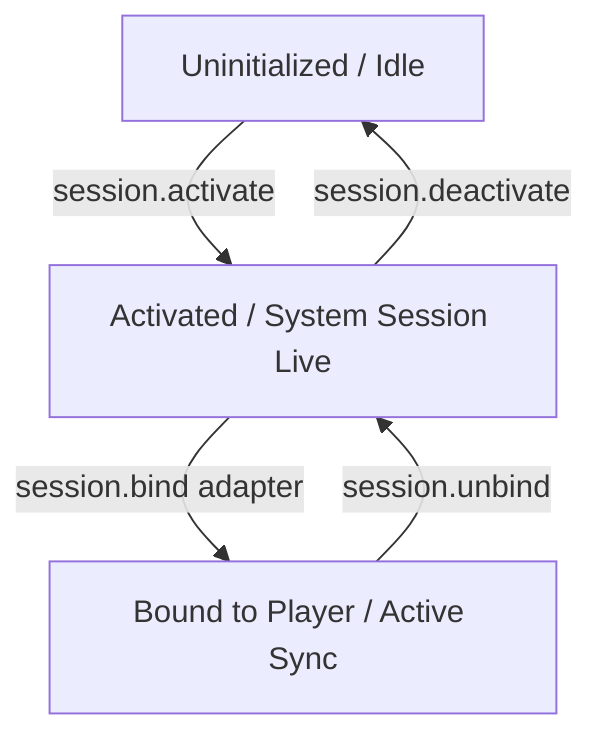

# Usage Guide

Learn how to integrate and use the `flutter_media_session` plugin in your application to synchronize media metadata and playback state with system-level controls using the modern **Adapter Pattern**.

---

## 1. Player Adapters

Rather than coupling the core package to specific audio libraries, `flutter_media_session` uses an **Adapter Pattern**. You can connect your preferred audio engine through a `MediaSessionAdapter`.

Ready-to-use adapter guides are provided for popular playback engines:

- **[`just_audio` Adapter Guide](adapters/just_audio.md)**: Full adapter implementation, queue mapping, and lifecycle binding for `just_audio`.
- **[`media_kit` Adapter Guide](adapters/media_kit.md)**: Complete adapter code with playlist tracking and playback synchronization for `media_kit`.

---

## 2. Writing a Custom Adapter

You can easily adapt any other media player (e.g. `audioplayers`, standard `video_player`, or a custom native player) by implementing the `MediaSessionAdapter` interface.

Here is an example for a generic player:

```dart
import 'dart:async';
import 'package:flutter_media_session/flutter_media_session.dart';
import 'package:flutter_media_session/flutter_media_session_platform_interface.dart';

class CustomPlayerAdapter implements MediaSessionAdapter {
  final MyPlayer player;
  final List<StreamSubscription> _subscriptions = [];
  FlutterMediaSession? _session;

  CustomPlayerAdapter(this.player);

  @override
  void bind(FlutterMediaSession session) {
    _session = session;

    // A. Sync metadata changes
    _subscriptions.add(player.trackStream.listen((track) {
      FlutterMediaSessionPlatform.instance.updateMetadata(MediaMetadata(
        title: track.title,
        artist: track.artist,
        album: track.album,
        artworkUri: track.coverUrl,
        duration: track.duration,
      ));
    }));

    // B. Sync playback status and progress
    _subscriptions.add(player.statusStream.listen((status) {
      FlutterMediaSessionPlatform.instance.updatePlaybackState(PlaybackState(
        status: status == MyStatus.playing ? PlaybackStatus.playing : PlaybackStatus.paused,
        position: player.currentPosition,
        speed: player.speed,
      ));
    }));

    // C. Forward system controls to player
    _subscriptions.add(FlutterMediaSessionPlatform.instance.onMediaAction.listen((action) {
      switch (action.name) {
        case 'play':
          player.resume();
          break;
        case 'pause':
          player.pause();
          break;
        case 'seekTo':
          if (action.seekPosition != null) {
            player.seek(action.seekPosition!);
          }
          break;
      }
    }));
  }

  @override
  void unbind() {
    for (final sub in _subscriptions) {
      sub.cancel();
    }
    _subscriptions.clear();
    _session = null;
  }
}
```

Then bind your adapter in one line:
```dart
session.bind(CustomPlayerAdapter(myPlayer));
```

---

## 3. Media Session Lifecycle

Understanding the session's lifecycle ensures robust notification management, background execution, and resource cleanup.


```mermaid
graph TD
    Idle[Uninitialized / Idle] -->|session.activate| Active[Activated / System Session Live]
    Active -->|session.bind adapter| Bound[Bound to Player / Active Sync]
    Bound -->|session.unbind| Active
    Active -->|session.deactivate| Idle
```

### Session States

1.  **Idle**: The initial state. No background service is running on Android, and lock screen/notification widgets are not active.
2.  **Activated**: Established by calling `session.activate()`. On Android, this boots up the background foreground-service which prevents the OS from killing your audio stream.
3.  **Bound**: Occurs when `session.bind(adapter)` is called. The adapter takes control of syncing states, metadata, and responding to lock screen play/pause/skip clicks.
4.  **Unbound**: Calling `session.unbind()` stops the active adapter from updating the media session and releases its player streams. The media session itself remains active.
5.  **Deactivated**: Established by calling `session.deactivate()`. Releases all system resources, tears down the Android foreground service, and clears system notifications.

---

## 4. Removed Legacy APIs

Legacy direct synchronization APIs on `FlutterMediaSession` have been removed in version **3.0.0**.

If you need to manually update state or handle actions without using an adapter, access them directly on the platform interface:
- `FlutterMediaSessionPlatform.instance.updateMetadata(...)`
- `FlutterMediaSessionPlatform.instance.updatePlaybackState(...)`
- `FlutterMediaSessionPlatform.instance.updateAvailableActions(...)`
- `FlutterMediaSessionPlatform.instance.onMediaAction`

---

## 5. Additional System Controls

### Audio Interruptions (Android)
To automatically handle interruptions (like phone calls or other apps starting audio), use `setAutoHandleInterruptions`:

```dart
await session.setAutoHandleInterruptions(true);
```
> [!WARNING]
> Keep this **disabled** (default is `false`) if your underlying media player (such as `audioplayers`, `just_audio`, or `media_kit`) already manages audio focus automatically.
> 
> Because `flutter_media_session` acts as a metadata/command shim, enabling this option will cause the plugin to request audio focus when playback starts. This will strip audio focus from your actual audio player within the same app, causing the actual player to immediately pause or go silent while the system media widget remains stuck in a "playing" state.
> 
> Only turn this **on** if your player does *not* request focus itself (e.g. using `video_player` with the `fvp`/`mdk` backend).

### Background Keep-Alive (Off-Device Casting)
To keep a backgrounded session alive when audio is rendered **off-device** (e.g. casting to Chromecast or a DLNA device on the local network), use `setBackgroundKeepAlive`:

```dart
await session.setBackgroundKeepAlive(true);
```

While enabled, the platform holds the best keep-alive primitive it has to prevent the connection from being torn down:
- **Android**: A partial wake lock (CPU) + high-performance Wi-Fi lock (radio), declaring `mediaPlayback|connectedDevice` foreground service types.
- **macOS**: An `IOPMAssertion` preventing idle system sleep.
- **Windows**: `SetThreadExecutionState` to request the system stay active.
- **Web**: Best-effort Screen Wake Lock.
- **iOS**: No-op (background survival depends on native audio playback).

Enable it only during active cast/off-device sessions and disable it when done to avoid unnecessary battery drain.

### Windows AppUserModelID & Flyout Setup

Windows identifies applications primarily through their **App User Model ID (AUMID)**. If an application does not configure an AUMID, the Windows Media Session Manager (SMTC) cannot resolve your app identity and displays "Unknown Application".

#### Option A: MSIX Packaging (Recommended)
When packaged as an MSIX (e.g. using the [`msix`](https://pub.dev/packages/msix) package), Windows automatically assigns and resolves the AUMID from the package manifest. The plugin automatically detects MSIX runtime and defers to the OS-managed identity.

#### Option B: Dynamic Shortcut for Unpackaged / Portable Apps
If you distribute portable ZIPs or run unpackaged builds, register the AUMID and a display name during app initialization. This dynamically registers a Start Menu shortcut required by SMTC to resolve the display title:

```dart
if (Platform.isWindows) {
  // Call early during initialization
  await session.setWindowsAppUserModelId(
    'YourCompany.YourApp.Id',
    displayName: 'Your App Name', // Creates dynamic shortcut for unpackaged apps
    // iconPath: 'C:\\path\\to\\icon.ico', // Optional custom icon
  );
}
```

> [!NOTE]
> If using custom installers (e.g., Inno Setup or WiX), configure the installer to set `AppUserModelID` on the Start Menu shortcut directly and omit `displayName` in the code.